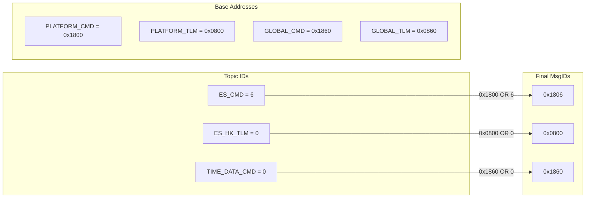
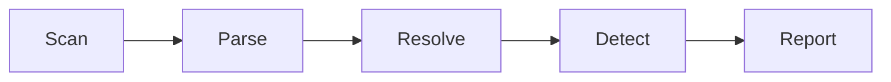

# cFS MsgID Guard

**Prevent silent Message ID collisions in NASA cFS missions.**

[](https://github.com/macaris64/cfs-msgid-guard/actions/workflows/ci.yml)
[](https://github.com/macaris64/cfs-msgid-guard)
[](LICENSE)
[](https://github.com/marketplace/actions/cfs-msgid-guard)

---

## The Problem

NASA's core Flight System (cFS) routes all inter-application communication through a Software Bus using **Message IDs**. Each application defines numeric **Topic IDs** in header files (`*_topicids.h`), which are combined with base addresses to produce final MsgIDs:

```
Final MsgID = Base Address | Topic ID
```

Topic IDs are scattered across dozens of header files in separate submodules with **no central registry and no collision check**. A developer who creates a new app and picks a topic ID already in use by another app gets a **silent runtime failure** — messages route to the wrong application with zero build errors or warnings.

**cfs-msgid-guard** scans your entire cFS mission, computes every MsgID across all four channels, detects collisions, and reports them as PR annotations before they reach flight hardware.

---

## How MsgID Calculation Works

cFS uses a 4-channel model. Each channel has a base address, and the final MsgID is computed by OR-ing the base with the topic ID:



| Channel | Base | Purpose |
|---------|------|---------|
| `PLATFORM_CMD` | `0x1800` | Instance-specific commands |
| `PLATFORM_TLM` | `0x0800` | Instance-specific telemetry |
| `GLOBAL_CMD` | `0x1860` | Broadcast commands (e.g., CFE_TIME) |
| `GLOBAL_TLM` | `0x0860` | Broadcast telemetry |

A collision occurs when two different applications claim the **same topic ID** within the **same channel**, producing identical MsgIDs and causing the Software Bus to misroute messages.

---

## Architecture

cfs-msgid-guard operates as a 5-phase pipeline:



| Phase | Module | Description |
|-------|--------|-------------|
| **Scan** | `scanner.ts` | Glob-based discovery of `*_topicids.h`, `*_msgids.h`, `*_msgid_values.h`, and base mapping files |
| **Parse** | `parser.ts` | Regex extraction of all `#define DEFAULT_*_TOPICID` values with file and line metadata |
| **Resolve** | `resolver.ts` | 2-tier channel classification + MsgID computation |
| **Detect** | `detector.ts` | Per-channel collision detection + configurable near-miss warnings |
| **Report** | `reporter.ts` | GitHub Job Summary, PR annotations, and machine-readable JSON output |

### 2-Tier Channel Classification

Determining whether a topic ID belongs to CMD or TLM (and PLATFORM vs GLOBAL) uses a two-tier strategy:

**Tier 1 — Header Analysis** (authoritative): Parses `*_msgids.h` and `*_msgid_values.h` files to find explicit channel assignments via two patterns:

- **Pattern A** (direct): `CFE_PLATFORM_CMD_TOPICID_TO_MIDV(TOPIC_NAME_TOPICID)` — the topic name appears directly inside the macro call
- **Pattern B** (indirect): A `MIDVAL` template in `*_msgid_values.h` is expanded with a parameter in `*_msgids.h` using token pasting (`##x##`)

**Tier 2 — Heuristic** (fallback): When no header mapping exists, the tool classifies by naming convention — names containing `_TLM`, `_MSG`, or `_DATA_TYPES` map to telemetry; everything else maps to command.

---

## Quick Start

Add this to your workflow (`.github/workflows/msgid-check.yml`):

```yaml
name: Message ID Check
on: [push, pull_request]

jobs:
  check-msgids:
    runs-on: ubuntu-latest
    steps:
      - uses: actions/checkout@v4
        with:
          submodules: true

      - uses: macaris64/cfs-msgid-guard@v1
        with:
          fail-on-collision: 'true'
          near-miss-gap: '2'
```

That's it. On every push and PR, the action scans your entire cFS tree and fails the build if any MsgID collisions are found.

---

## Inputs

| Input | Description | Default |
|-------|-------------|---------|
| `scan-paths` | Root directories to scan (comma-separated) | `.` |
| `topicid-pattern` | Glob for topic ID headers | `**/*_topicids.h` |
| `msgid-pattern` | Glob for MsgID definition headers (channel classification) | `**/*_msgids.h` |
| `cmd-base` | Platform command MsgID base address | `0x1800` |
| `tlm-base` | Platform telemetry MsgID base address | `0x0800` |
| `global-cmd-base` | Global command MsgID base address | `0x1860` |
| `global-tlm-base` | Global telemetry MsgID base address | `0x0860` |
| `fail-on-collision` | Fail the workflow if a collision is detected | `true` |
| `near-miss-gap` | Warn about topic IDs within N of each other (0 to disable) | `0` |
| `report-format` | Output format: `summary`, `json`, or `both` | `both` |

## Outputs

| Output | Description |
|--------|-------------|
| `collision-count` | Number of MsgID collisions found |
| `has-collisions` | Whether any collisions were found (`true`/`false`) |
| `allocation-map` | JSON string of the full MsgID allocation map |

---

## Example Output

When run against the default NASA cFS Draco bundle (9 apps, 42 topic IDs), the Job Summary shows:

### Executive Summary

| Metric | Value |
|--------|------:|
| Applications Scanned | 9 |
| Topic IDs Resolved | 42 |
| Collisions Detected | 0 |
| Near-Miss Warnings | 0 |

### Allocation Map (excerpt)

| App | Topic Name | Topic ID | MsgID | Status |
|-----|-----------|:--------:|:-----:|:------:|
| CFE_ES | `CFE_MISSION_ES_CMD` | `0x0006` | `0x1806` | OK |
| CFE_TIME | `CFE_MISSION_TIME_CMD` | `0x0005` | `0x1805` | OK |
| SAMPLE_APP | `SAMPLE_APP_MISSION_CMD` | `0x0082` | `0x1882` | OK |
| TO_LAB | `TO_LAB_MISSION_CMD` | `0x0080` | `0x1880` | OK |

When a collision is detected, the output changes to:

| App | Topic Name | Topic ID | MsgID | Status |
|-----|-----------|:--------:|:-----:|:------:|
| APP_A | `APP_A_MISSION_CMD` | `0x0082` | `0x1882` | **COLLISION** |
| APP_B | `APP_B_MISSION_CMD` | `0x0082` | `0x1882` | **COLLISION** |

PR annotations pinpoint the exact file and line of each conflicting `#define`.

---

## CLI Usage

You can run MsgID collision detection locally — no GitHub Actions required.

### Quick Start

```bash
# Run directly (no install needed)
npx cfs-msgid-guard --scan-path /path/to/cfs-mission

# Or install globally
npm install -g cfs-msgid-guard
cfs-msgid-guard --scan-path .

# Or as a dev dependency
npm install --save-dev cfs-msgid-guard
npx cfs-msgid-guard
```

### CLI Flags

| Flag | Default | Description |
|------|---------|-------------|
| `--scan-path <path>` | `.` | Root directory to scan |
| `--topicid-pattern <glob>` | `**/*_topicids.h` | Topic ID header glob |
| `--msgid-pattern <glob>` | `**/*_msgids.h` | MsgID header glob |
| `--cmd-base <hex>` | `0x1800` | Platform CMD base address |
| `--tlm-base <hex>` | `0x0800` | Platform TLM base address |
| `--global-cmd-base <hex>` | `0x1860` | Global CMD base address |
| `--global-tlm-base <hex>` | `0x0860` | Global TLM base address |
| `--near-miss-gap <n>` | `0` | Warn about IDs within N of each other |
| `--no-fail-on-collision` | | Exit 0 even with collisions |
| `--format <table\|json\|summary>` | `table` | Output format |
| `--no-color` | | Disable ANSI colors |

### Examples

```bash
# Scan with near-miss warnings
cfs-msgid-guard --scan-path . --near-miss-gap 3

# JSON output for scripting
cfs-msgid-guard --format json --scan-path .

# Custom base addresses
cfs-msgid-guard --cmd-base 0x2000 --tlm-base 0x1000

# CI-friendly: no color, exit 0 for reporting only
cfs-msgid-guard --no-color --no-fail-on-collision
```

Exit codes: `0` = clean, `1` = collisions found (or no files), `2` = fatal error.

---

## Advanced Usage

### Custom Base Addresses

If your mission uses non-standard base addresses:

```yaml
- uses: macaris64/cfs-msgid-guard@v1
  with:
    cmd-base: '0x2000'
    tlm-base: '0x1000'
    global-cmd-base: '0x2060'
    global-tlm-base: '0x1060'
```

### Warning-Only Mode

To detect collisions without failing the build:

```yaml
- uses: macaris64/cfs-msgid-guard@v1
  with:
    fail-on-collision: 'false'
    near-miss-gap: '3'
```

### JSON Output for Downstream Tools

Use the `allocation-map` output in subsequent workflow steps:

```yaml
- uses: macaris64/cfs-msgid-guard@v1
  id: guard
  with:
    report-format: 'json'

- run: echo '${{ steps.guard.outputs.allocation-map }}' | jq '.allocations[] | select(.channel == "PLATFORM_CMD")'
```

---

## Development

```bash
# Install dependencies
npm install

# Run tests (208 tests)
npm test

# Run with coverage (100% required)
npm run test:coverage

# Lint
npm run lint

# Type check
npm run typecheck

# Build both bundles (dist/index.js + dist/cli.js)
npm run build

# Quick manual test against bundled NASA fixtures
npm run test:manual
```

### Dual Build

The project ships two independent bundles from the same pipeline engine:

| Bundle | Built by | Purpose |
|--------|----------|---------|
| `dist/index.js` | `npm run build:action` | GitHub Action entry point (`action.yml` main) |
| `dist/cli.js` | `npm run build:cli` | CLI entry point (`package.json` bin) |

`npm run build` produces both. The CLI bundle has zero dependency on `@actions/core`.

See [CONTRIBUTING.md](CONTRIBUTING.md) for detailed contribution guidelines.

---

## License

Apache-2.0. See [LICENSE](LICENSE) for details.
